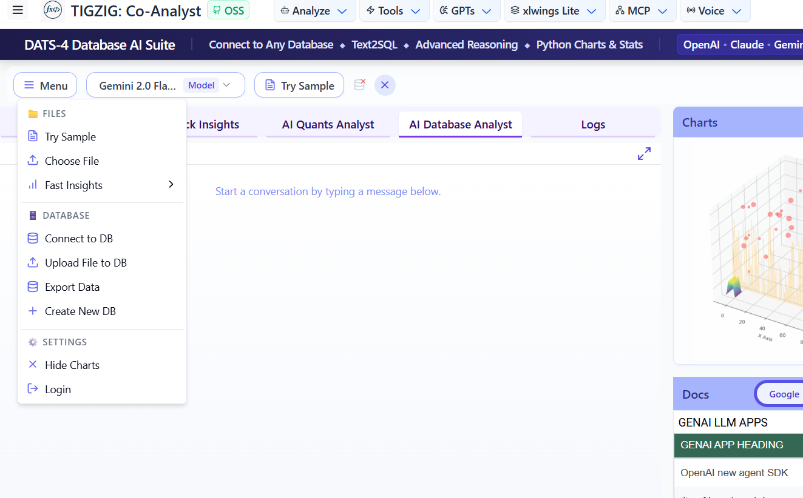
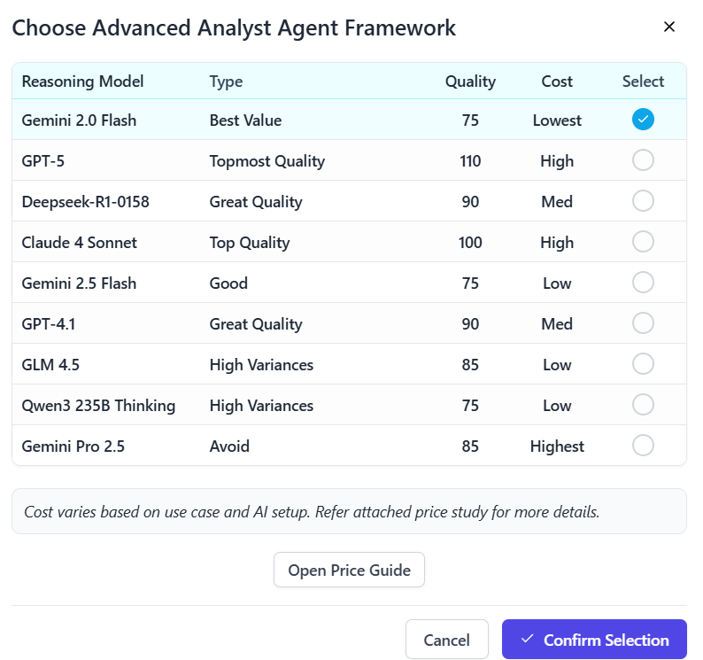
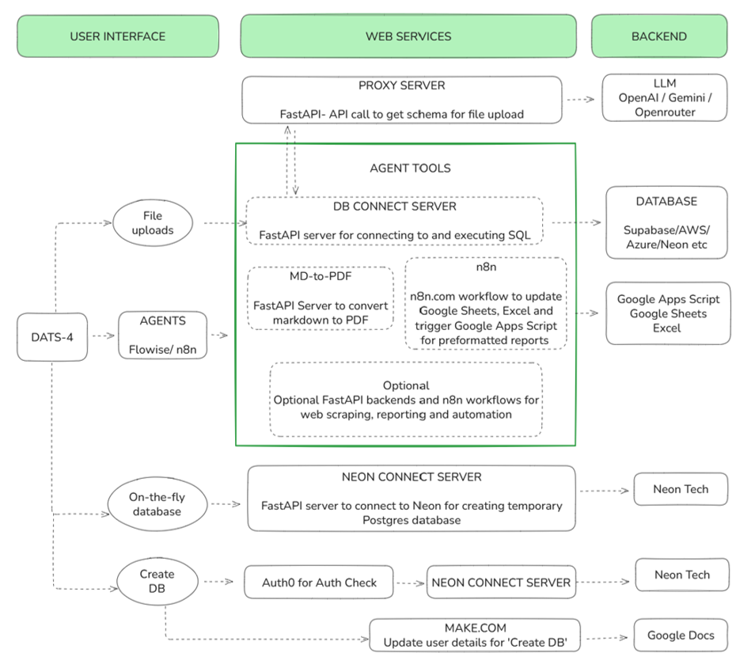

# DATS-4 Database AI Suite

## Live App
A full version of this app is deployed and available at [app.tigzig.com](https://app.tigzig.com)

## Documentation
- **[User Guide](./USERGUIDE.md)** - Comprehensive guide on how to use the application
- **[App Architecture](./docs/APP_ARCHITECTURE.md)** - Detailed explanation of the application architecture
- **Setup Guide** - Continue reading below for installation and setup instructions

---

## About The Project

The DATS-4 Database AI Suite is a tool for AI-driven data analysis against relational databases. Its primary function is to connect to remote PostgreSQL or MySQL databases to execute queries. Queries can be simple or part of a complex analysis, run through either a single AI agent or a multi-agent framework.

The tool also supports file uploads (CSV, tab-delimited). Uploaded files can be loaded into a pre-existing database connection or into a temporary database created on the fly. Additional features include the ability to generate Python charts, perform statistical analysis, and create PDF reports.

<p align="center">
  
  
</p>

### Key Features

*   **Remote Database Connectivity**: Connect to existing PostgreSQL or MySQL databases to run queries and perform analysis.
*   **Multi-Agent AI Analysis**: Execute queries ranging from simple lookups to complex analysis using either a single AI agent or a multi-agent framework with models like GPT-4, Claude, and Gemini.
*   **File Upload and Ingestion**: Upload CSV or tab-delimited files. Data can be loaded into a connected database or a temporary database created automatically for the session.
*   **Data Visualization and Reporting**: Generate charts using Python's matplotlib, perform statistical analysis, and export results or reports as PDF documents.
*   **Interactive Data Tables**: View and interact with table data from your connected database or uploaded files.
*   **Conversational AI Chat**: Use a chat-based interface to query an AI analyst about the data.
*   **Responsive Design**: The interface supports both mobile and desktop devices.

---

## Getting Started
Follow these instructions to set up and run the project locally.


### 1. Clone the Repository
First, clone the repository to your local machine using the following command:
```bash
git clone <https://github.com/amararun/shared-rexdb-file-upload> . 
```
Note: Check for the latest shared repository name in case it has changed.


### 2. A Note on Analytics Tracking
The live versions of my apps use Statcounter for basic web analytics. This open-source codebase is a direct clone of the live public version, so my tracking snippets are present in index.html and other relevant page files

**Before you deploy, you must either**

**Replace** these snippets with your own analytics provider's code (e.g.,StatCounter, Google Analytics)  
**Remove** them entirely.


### 3. Navigate to the Frontend Directory
Move into the `frontend` directory where the application dependencies are managed:
```bash
cd frontend
```

### 4. Install Dependencies
Install the necessary dependencies using npm.
```bash
npm install
```


### 5. Update .env File
Create a `.env` file in the `frontend` folder by copying the `frontend/.env.example` file. This file contains all the necessary environment variables to run the application. 

**Important:** The values in the `.env.example` file and listed below are for demonstration purposes only. They are placeholders and dummy values. You must replace them with your own valid API keys, endpoints, and credentials for the application to function correctly.

Below is a detailed explanation of each variable.

```env
# -------------------------
# AI Agent Endpoints (Flowise)
# -------------------------

# This endpoint is for the "AI Quants Analyst" tab.
VITE_FLOWISE_API_ENDPOINT=""

# These endpoints correspond to the models available in the Advanced Analyst model selector.
VITE_AGENT_20_FLASH="https://your-flowise-hosted-url.com/api/v1/prediction/c90f8fe6-f85f-4eb2-9fcb-dbcba0b"   # Gemini 2.0 Flash
VITE_AGENT_DEEPSEEK_R1="https://your-flowise-hosted-url.com/api/v1/prediction/daa92f93-3b9e-4fef-8f30-68c40"   # Deepseek-R1-0158
VITE_AGENT_37_CLAUDE="https://your-flowise-hosted-url.com/api/v1/prediction/4cbc6c57-95a1-4c05-a0d5-45e3b12"   # Claude 4 Sonnet
VITE_AGENT_25_FLASH="https://your-flowise-hosted-url.com/api/v1/prediction/1357db34-4979-4705-897b-3bcffc9"    # Gemini 2.5 Flash
VITE_AGENT_QWEN3_32B="https://your-flowise-hosted-url.com/api/v1/prediction/02d55f15-0eff-4e16-aab8-226b099"   # Now GLM 4.5
VITE_AGENT_QWEN3_235B="https://your-flowise-hosted-url.com/api/v1/prediction/14f21744-508a-49f9-9138-3d85b4d"  # Qwen3 235B Thinking
VITE_AGENT_O4_MINI="https://your-flowise-hosted-url.com/api/v1/prediction/3d2d0b2c-d4db-4692-a154-70fbef7"     # Now GPT-5
VITE_AGENT_GPT_41="https://your-flowise-hosted-url.com/api/v1/prediction/048c5c3c-59c8-4b7a-8b6a-e399d5b"      # GPT-4.1
VITE_AGENT_25_PRO="https://your-flowise-hosted-url.com/api/v1/prediction/25a6b409-8831-4a84-a374-cdf50b7"      # Gemini Pro 2.5

VITE_FLOWISE_IMAGE_URL="https://your-flowise-hosted-url.com/api/v1/get-upload-file"                             # Flowise endpoint to get chart images


# -------------------------
# Backend Service Endpoints
# -------------------------

# DATABASE API Server (Handles all SQL query executions)
VITE_API_ENDPOINT=""

# Neon Database Management Server (Handles creation of serverless PostgreSQL DBs)
VITE_NEON_API_URL=""

# LLM Proxy Server (Securely routes all LLM API calls)
VITE_RT_ENDPOINT=""

# -------------------------
# Authentication (Auth0)
# -------------------------
# Used for the "Create New DB" feature. The app is functional without it.

VITE_AUTH0_DOMAIN=""
VITE_AUTH0_CLIENT_ID=""

# -------------------------
# Optional & Legacy Settings
# -------------------------

# Make.com Webhook (Tracks new database creation events)
VITE_MAKE_WEBHOOK_URL=""

# Legacy setting, no longer used in the current UI
VITE_SHOW_REX_DB_BUTTON="false"
```

The `.env.example` file in the frontend directory contains these sample values with slight modifications to make them non-functional while maintaining the correct format. Never commit the actual `.env` file with real credentials to version control.

### 6. Setup Backend FastAPI Servers
The application relies on three crucial FastAPI servers that handle different aspects of the functionality. You'll need to set up these servers to utilize the application's features. Each of these repositories have their own set of instructions shared in their respecive README files.



#### 6.1 LLM Proxy Server (`VITE_RT_ENDPOINT`)
```bash
git clone https://github.com/amararun/shared-rtWebrtc-fastAPI-ephemeral .
```
The LLM Proxy Server acts as a secure intermediary for all LLM API calls. It:
- Routes all calls to OpenAI and OpenRouter endpoints through a secure proxy
- Manages API keys centrally, preventing exposure in the frontend
- Adds an additional layer of regional security
- Handles rate limiting and request validation
- Provides logging and monitoring capabilities

#### 6.2 DATABASE API Server (`VITE_API_ENDPOINT`)
```bash
git clone https://github.com/amararun/shared-fastapi-rex-db-coolify .
```
The DATABASE API Server serves as the database connector between the frontend application and backend databases:
- Accepts SQL queries generated by either LLM agents or the JavaScript application
- Establishes secure database connections using provided credentials
- Executes various types of SQL operations:
  - SELECT queries for data retrieval
  - ALTER queries for schema modifications
  - UPDATE/INSERT operations for data manipulation
  - Table creation and management
  - Data summarization and analytics
  - Full table exports and downloads
- Handles database credentials securely
- Supports connection to multiple database types
- Provides query validation and error handling

#### 6.3 Neon Database Management Server (`VITE_NEON_API_URL`)
```bash
git clone https://github.com/amararun/shared-rexdb-fastapi-neon .
```
The Neon API Server manages the creation and lifecycle of serverless PostgreSQL databases:
- Creates fully functional databases instantly (within seconds)
- Supports the app's "Create DB" functionality
- Manages temporary database provisioning:
  - Creates databases on-demand for temporary sessions
  - Handles automatic cleanup of temporary databases
  - Supports session management and database lifecycle
- Integrates with Neon's serverless PostgreSQL platform
- Provides database status monitoring and management

Each server requires its own configuration and setup. Detailed setup instructions are available in their respective repositories.

### 7. Setup Flowise Agent Flows
The application uses five different agent flows set up in Flowise, each serving different analytical purposes. These flows need to be configured in your Flowise instance.

#### 7.1 Available Agent Flows
1.  **AI Quants Analyst**: Mapped to `VITE_FLOWISE_API_ENDPOINT`, this agent handles general-purpose queries and is available in its own dedicated tab.
2.  **Advanced AI Database Analysts**: The following nine models are available in the model selector for advanced, sequential analysis:
    *   Gemini 2.0 Flash
    *   Deepseek-R1-0158
    *   Claude 4 Sonnet
    *   Gemini 2.5 Flash
    *   GLM 4.5
    *   Qwen3 235B Thinking
    *   o4-Mini
    *   GPT-4.1
    *   Gemini Pro 2.5

#### 7.2 Flow Components
Each agent flow is composed of:
- Sequential Agent configurations
- Simple Agent setups
- Custom Tools:
  - Database Connector Tool (connects to DATABASE FastAPI backend)
  - Python Code Interpreter Tool
  - Additional custom tools as per flow requirements

#### 7.3 Setup Instructions
1. Locate the flow schemas in the `docs` folder
2. Import the JSON schema files into your Flowise instance
3. Update necessary configurations in the imported flows:
   - API endpoints
   - System prompts
   - Tool configurations
4. Deploy the flows and copy the prediction API endpoints
5. Update your `.env` file with the new prediction API endpoints

#### 7.4 Documentation
The following documentation is available in the `docs` folder:
- JSON schemas for all agent flows and custom tools
- System prompts collection document

Note: All system prompts used in these flows are embedded within their respective JSON schemas and are also separately documented in the system prompts collection document for reference.

### 8. Setup Auth0 Authentication (Optional)
This is an experimental, non-essential feature that is only used for the "Create New DB" functionality. The application will function normally without authentication enabled.

#### 8.1 Usage Context
- Only required for the "Create New DB" button functionality
- Created databases are automatically removed after one year
- Not required for temporary database creation during file uploads
- Not required for sample file processing

#### 8.2 Setup Instructions
1. Create an Auth0 account if you don't have one
2. Configure your Auth0 application settings
3. Update the following environment variables:
```env
VITE_AUTH0_DOMAIN="your_auth0_domain"
VITE_AUTH0_CLIENT_ID="your_auth0_client_id"
```

Note: The application's core features, including temporary database creation and file processing, will continue to work without Auth0 authentication. Only the manual "Create New DB" feature requires authentication.

### 9. Security - IP Whitelisting
The application implements IP-based access control for all backend services. This security measure ensures that only authorized sources can access the various endpoints. It is recommended to whitelist the frontend deployment domains and any local development environments.

#### 9.1 Whitelisted Endpoints
The following endpoints should be protected by IP whitelisting:

1.  **Flowise API Endpoints**: All 10 agent endpoints (the 9 advanced models and the 1 general purpose model) should be whitelisted.
2.  **Backend FastAPI Servers**:
    *   LLM Proxy Server (`VITE_RT_ENDPOINT`)
    *   DATABASE API Server (`VITE_API_ENDPOINT`)
    *   Neon Database Management Server (`VITE_NEON_API_URL`)

#### 9.2 Whitelisted Sources
Access is restricted to:
- Frontend deployment domains
- Local development environments (`localhost`)

#### 9.3 Example Whitelist Configuration
Your whitelist configuration in each server should look similar to this:
```python
ALLOWED_ORIGINS = [
    "https://app.tigzig.com",        # Your frontend deployment domain
    "http://localhost:8100",         # For local development as per your choice
    "http://localhost:5100"          # For local development as per your choice
]
```

Note: The specific whitelisting configuration details and exact port numbers are provided in the respective setup documentation for each server repository. Adjust the domains and ports according to your deployment environment.

### 10. Setup Make.com Workflow (Optional)
This is an optional tracking feature that helps monitor database creation through a simple webhook workflow.

#### 10.1 Purpose
- Tracks new database creation events
- Collects user ID, email, and database name
- Maintains a record of created databases for management purposes
- Helps in tracking database lifecycle and cleanup

#### 10.2 Implementation
- Uses Make.com (formerly Integromat) workflow
- Triggered when a new authenticated user creates a database
- Stores tracking information in a separate document
- JSON schema for the workflow available in the `docs` folder

#### 10.3 Setup
1. Import the workflow schema from the `docs` folder into Make.com (or your preferred workflow automation tool)
2. Configure the webhook endpoint
3. Update the environment variable:
```env
VITE_MAKE_WEBHOOK_URL="your_make_webhook_url"
```

Note: This is an experimental feature that could be integrated directly into the backend databases. The application functions fully without this tracking system in place

### 11. Run the Development Server
Ensure you are in the `frontend` directory where npm dependencies are installed before starting the development server:

```bash
# If not already in the frontend directory
cd frontend

# Start the development server
npm run dev
```

The application should now be running locally. All npm dependencies and scripts are configured in the frontend directory, so make sure you're in the correct location before running any npm commands

### 12. Deployment
You can deploy this application on various hosting platforms such as Vercel, Netlify, or any other hosting provider of your choice.

#### 12.1 Vercel Deployment
Vercel offers a streamlined deployment process:
1. Connect your repository to Vercel
2. The platform will automatically detect the build and run settings

Important: Remember to configure all environment variables in your Vercel project settings (or your chosen hosting provider's environment configuration). These should match the variables from your local `.env` file:
- All Flowise API endpoints
- Backend FastAPI server endpoints
- Authentication settings
- Additional configuration variables

Note: Similar for other hosting providers. Always ensure your environment variables are properly configured in your hosting platform's settings before deploying.

-------
Built by Amar Harolikar // More tools at [app.tigzig.com](https://app.tigzig.com)  // [LinkedIn Profile](https://www.linkedin.com/in/amarharolikar)
## Author

Built by [Amar Harolikar](https://www.linkedin.com/in/amarharolikar/)

Explore 30+ open source AI tools for analytics, databases & automation at [tigzig.com](https://tigzig.com)
